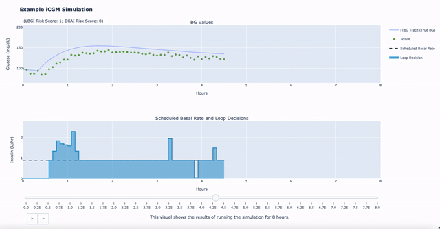

# Figures for Data Science Risk Analyses

 ## Project Objective
The purpose of this project is to create figures, tables, and animation for exploratory 
analysis of Tidepool Data Science Team risk analyses results. 

## Definition of Done
This phase of the project will be done when exploratory analysis for these projects is completed and final figures are 
approved. This project can then become a more permanent (non-exploratory) repository for final report figures.

## Project Description
This project includes:
- Figure code for the analysis of **missed insulin pulses** (`insulin_pulses_animation.py`, `insulin_pulses_figures.py`)

- **Replay loop exploratory figure code** (`replay_loop_exploratory_figure_examples.py`). 
This code is very work and progress and left just in case anyone goes back to thinking about ways to visualize that.

- **Code for iCGM sensitivity analysis figures**, including the code used for exploratory analysis 
(labeled [ARCHIVE]) and a more recent and up to date file that can be run for aggregated data 
and figures for the iCGM sensitivity analysis (`icgm_sensitivity_analysis_report_figures_and_tables.py`).

- Generalized visualization **code for creating matplotlib and plotly 
animations/static visualizations of simulation output** that more or less match
Tidepool style guidelines. Files for those visualizations include `simulation_figure_matplotlib.py`, `simulation_figure_plotly.py`, 
`simulation_figures_shared_functions`, `simulation_figures_demo_examples`. 
Example output of the demo code is shown below.

### Technologies
* Python
* [Anaconda](https://www.anaconda.com/)
* Pandas for working with data
* Google Colab for sharing examples
* Plotly

## Getting Started with the Conda Virtual Environment
1. Install [Miniconda](https://conda.io/miniconda.html). CAUTION for python virtual env users: Anaconda will automatically update your .bash_profile
so that conda is launched automatically when you open a terminal. You can deactivate with the command `conda deactivate`
or you can edit your bash_profile.
2. If you are new to [Anaconda](https://docs.anaconda.com/anaconda/user-guide/getting-started/)
check out their getting started docs.
3. If you want the pre-commit githooks to install automatically, then following these
[directions](https://pre-commit.com/#automatically-enabling-pre-commit-on-repositories).
4. Clone this repo (for help see this [tutorial](https://help.github.com/articles/cloning-a-repository/)).
5. In a terminal, navigate to the directory where you cloned this repo.
6. Run `conda update -n base -c defaults conda` to update to the latest version of conda
7. Run `conda env create -f conda-environment.yml --name [input-your-env-name-here]`. This will download all of the package dependencies
and install them in a conda (python) virtual environment. (Insert your conda env name in the brackets. Do not include the brackets)
8. Run `conda env list` to get a list of conda environments and select the environment
that was created from the environmental.yml file (hint: environment name is at the top of the file)
9. Run `conda activate <conda-env-name>` or `source activate <conda-env-name>` to start the environment.
10. If you did not setup your global git-template to automatically install the pre-commit githooks, then
run `pre-commit install` to enable the githooks.
11. Run `deactivate` to stop the environment.

## Maintaining Compatability with venv and virtualenv
This may seem counterintuitive, but when you are loading new packages into your conda virtual environment,
load them in using `pip`, and export your environment using `pip-chill > requirements.txt`.
We take this approach to make our code compatible with people that prefer to use venv or virtualenv.
This may also make it easier to convert existing packages into pypi packages. We only install packages directly
in conda using the conda-environment.yml file when packages are not available via pip (e.g., R and plotly-orca).

## Getting Started with this project
Note: Tidepool data for this project is not kept in the repository so figures cannot be run directly.
